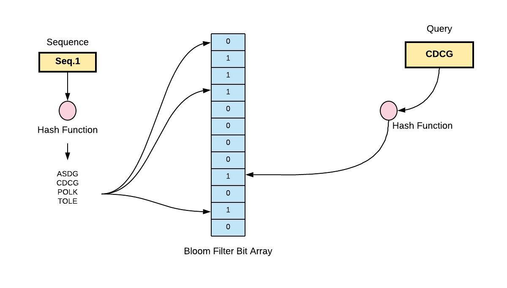

# Introduction

<p>Bloom filter made with Redisbloom module, integrated with Nodejs (ioredis)</p>

&nbsp;

# Technologies

- Nodejs
- Expressjs
- Typescript
- Redis(Redisbloom module)

&nbsp;

# What is a Bloom Filter

A Bloom filter is a space-efficient probabilistic data structure, conceived by Burton Howard Bloom in 1970, that is used to test whether an element is a member of a set. False positive matches are possible, but false negatives are not – in other words, a query returns either "possibly in set" or "definitely not in set". Elements can be added to the set, but not removed (though this can be addressed with the counting Bloom filter variant); the more items added, the larger the probability of false positives.


&nbsp;

In redisBloom module you just have specify the err rate and no.of items then redis will take care of no.of hash function needed,we just have to insert data into it.

&nbsp;

## Run Redis Server

```
git clone --recursive https://github.com/RedisBloom/RedisBloom.git
```

```
redis-server --loadmodule /path/to/redisbloom.so
```

&nbsp;

## ⭕To create a Bloom filter

```REDIS
BF.RESERVE checkusername 0.00001 10000
```

Here checkusername is Key,0.00001 is the err rate,10000 is No.of items(username)

&nbsp;

## ⭕To Add Items To Bloom Filter

```REDIS
BF.ADD checkusername leoantony72
```

&nbsp;

## ⭕To Check Items Is In Bloom Filter

```REDIS
BF.EXISTS checkusername leoantony72
```

If username is present it will return 1 else 0

&nbsp;

## ⭕To Debug Bloom Filter

```REDIS
BF.DEBUG checkusername
```

It will return 👉

```
1) "size:1951"
2) "bytes:31760 bits:254080 hashes:18 hashwidth:64 capacity:10000 size:1951 ratio:5e-06"
```

#

<h3>This is a basic bloom filter , if you want to learn more check out official redisbloom website 👨‍💻</h3>
